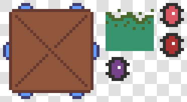

# AtlasExtruder
Extrude sprite frames on exported [Aseprite](https://github.com/aseprite/aseprite) atlases. This script uses [Pillow](https://python-pillow.org/) to edit the atlas image.

* The function takes both a path to the exported image and a path to the exported json file containing all sprite frame locations.
* The atlas must have enough padding between the frames to prevent the extrusion process from overwriting pixels. When using the [CLI](https://www.aseprite.org/docs/cli/), use these parameters to create two pixel wide borders between frames: `--border-padding 1 --shape-padding 2`.

Aseprite currently cannot extrude sprite frames when packing sprite sheets. This script provides a workaround until [this issue](https://github.com/aseprite/aseprite/issues/2072) is resolved.